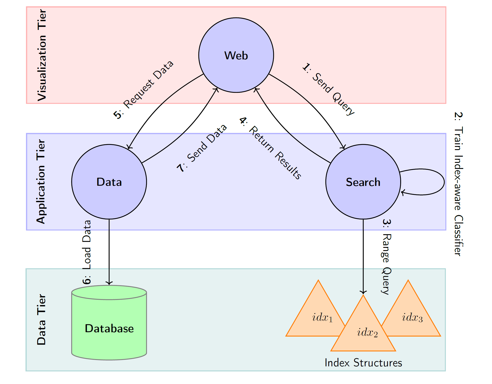

# CLIP-Branches: Interactive Fine-Tuning for Text-Image Retrieval
This repository contains the source code for the paper *"CLIP-Branches: Interactive Fine-Tuning for Text-Image Retrieval"*. Our prototype is available via this [link](https://web.clip-branches.net/). 


## Installation
1. Clone the repository
```git clone https://github.com/cluel01/clip-branches.git``` 

2. Install the required packages
```bash pip install -r requirements.txt```

3. Install CLIP library:
```bash pip install git+https://github.com/openai/CLIP.git```

### Pre-requisites
Before actually running the application and submitting queries, you need to first run through the **offline preprocessing** phase as shown in the figure.


This involves the following steps:
1. **Download Dataset**: Download image datasets of your choice. We provide a script to download the Shutterstock dataset used in our experiments. Please ensure to download the metadata first via the [link](https://drive.google.com/file/d/1mSNAL7u8y39O_fb66f38uLRm1zUnDH9O/view?usp=sharing).

```bash python download_shutterstock.py```

2. **Preprocess Images**: Preprocess the images and labels and store them in a format that can be used by the CLIP model. Thereby, we bring the images and labels into a suitable format for the CLIP feature extractor and filter out incorrect images/text pairs. As an output, we get a CSV file that can be used in the next steps. An example is given for the Shutterstock dataset.

```bash python preprocess.py```

3. **Extract Features**: Extract image and text features using the CLIP model. The extracted features are stored in a file that can be used in the next steps. Make sure that you have downloaded our finetuned weighs for the CLIP model in advance via this [link](https://drive.google.com/file/d/1mSNAL7u8y39O_fb66f38uLRm1zUnDH9O/view?usp=sharing). Alternatively, you can also use the original CLIP model and weights.

```bash python extract_features.py```


### Running the Application
Now, we have to configure the services and start them. The architecture of our search platform is depicted in the following figure. It consists of the three services: **Search**, **Data**, and **Web**. The Search service is responsible for the actual search functionality, the Data service provides the data for the search service, and the Web service is the user interface for the search service.


The services are provided as Docker containers and can be started as follows:

4. **Configure Search App**: Configure the search service by adjusting the file `assets/search/config.json` to point to the extracted features and the preprocessed data. Afterwards, build the docker image and start the search service.

```bash docker build -t clip-branches-search -f Dockerfile.search .```
```bash docker run -p 5000:5000 clip-branches-search```

5. **Configure Data App**: Configure the data service by adjusting the file `assets/data/config.json` to point to the preprocessed data. Afterwards, build the docker image and start the data service.

```bash docker build -t clip-branches-data -f Dockerfile.data .```
```bash docker run -p 5001:5001 clip-branches-data```

6. **Configure Web App**:
Configure the web service by adjusting the file `assets/web/config.json` to point to the search and data services. Afterwards, build the docker image and start the web service.

```bash docker build -t clip-branches-web -f Dockerfile.web .```
```bash docker run -p 8080:8080 clip-branches-web```

7. **Access the Web App and start search**: Access the web application via `http://localhost:8080` in your browser.

## Demo Video
[](https://youtu.be/lepPM3zi0l8)

[Video](https://youtu.be/lepPM3zi0l8)


## Citation
If you find this work useful, please consider citing our paper:
```
@inproceedings{10.1145/3626772.3657678,
author = {L\"{u}lf, Christian and Lima Martins, Denis Mayr and Vaz Salles, Marcos Antonio and Zhou, Yongluan and Gieseke, Fabian},
title = {CLIP-Branches: Interactive Fine-Tuning for Text-Image Retrieval},
year = {2024},
isbn = {9798400704314},
publisher = {Association for Computing Machinery},
address = {New York, NY, USA},
url = {https://doi.org/10.1145/3626772.3657678},
doi = {10.1145/3626772.3657678},
booktitle = {Proceedings of the 47th International ACM SIGIR Conference on Research and Development in Information Retrieval},
pages = {2719–2723},
numpages = {5},
keywords = {clip, quantization, relevance feedback, text-image retrieval},
location = {Washington DC, USA},
series = {SIGIR '24}
}
```

